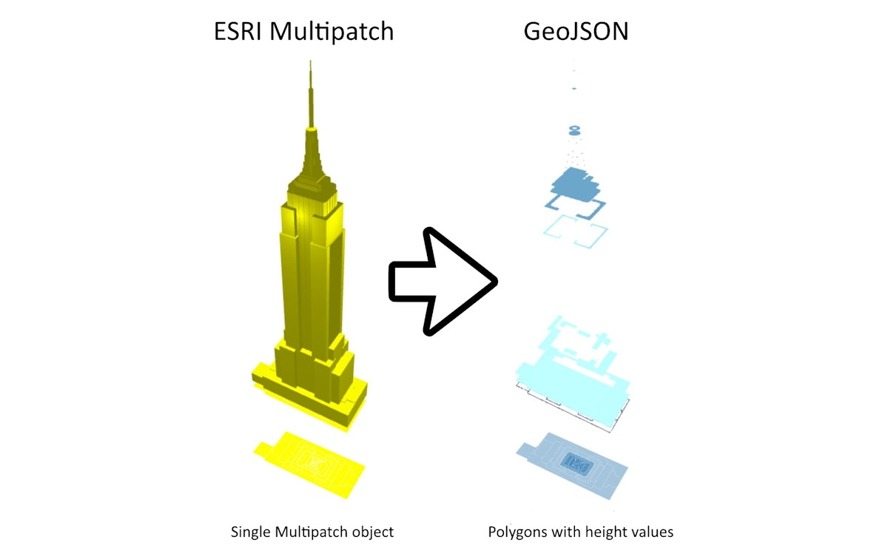

# NYC 3D Building Multipatch Convertor

This project provides a **multipatch_convertor()** function designed to transform New York City's 3D building model files from [ESRI Multipatch](https://support.esri.com/en/white-paper/1483) format to GeoJSON using the [GeoPandas](http://geopandas.org/) library. The output will contain a seperate polygon for each building part of differing height, each tagged with a height value in meters.

The City's Multipatch building models can be downloaded from the Office of Technology & Innovation (OTI) at [https://www.nyc.gov/content/oti/pages/#digital-tools](https://www.nyc.gov/content/oti/pages/#digital-tools).

This work is based on the [multipatch_convertor](https://github.com/bbonczak/multipatch_convertor) script by [Bartosz Bończak](https://bbonczak.com/projects/nyc-energy-map/), which was originally used to create the 3D view for the [NYC Energy & Water Performance Map](https://energy.cusp.nyu.edu/).
